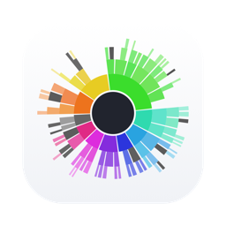
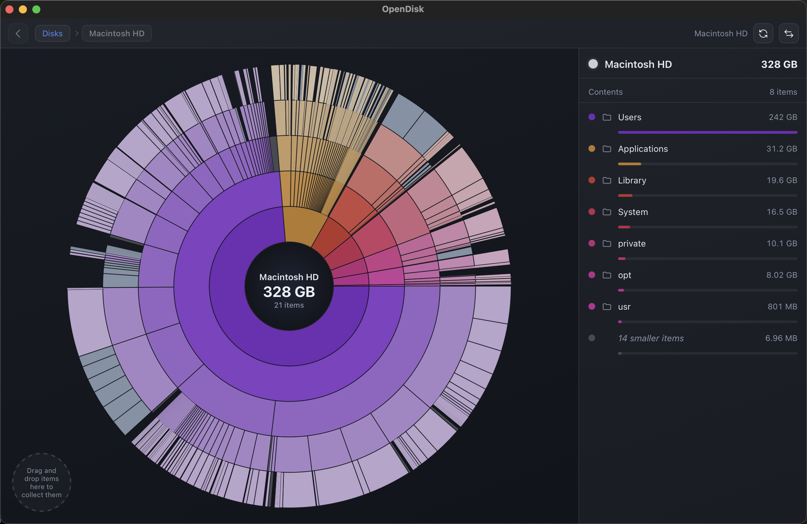

<div align="center">
  

  # OpenDisk

  **A beautiful, blazing-fast, open-source disk space analyzer for macOS.**

  See what's eating your disk on an interactive sunburst map — then free it up in a few clicks.

  [](https://github.com/csdlmysql/opendisk/releases/latest)

  [](https://github.com/csdlmysql/opendisk/releases/latest)
  [](https://github.com/csdlmysql/opendisk/actions)
  [](LICENSE)
  
  [](CONTRIBUTING.md)

  
</div>

---

## ✨ Features

- 🚀 **Blazing-fast scans** — parallel Rust scanner across all CPU cores; measures real on-disk size (block-based, like `du`); millions of files in seconds on a warm cache
- ☀️ **Interactive sunburst map** — hover for details, click to zoom into any folder, click the center to go back, buttery-smooth animations
- 📊 **Real-time progress** — live file counts and accumulated size while scanning, plus an iOS-style progress ring right on the Dock icon
- 🔍 **Large & old files finder** — filter by type (images, video, disk images, …) and age, sortable columns, export to CSV/JSON
- 🧬 **Duplicate finder** — exact duplicates via full BLAKE3 content hashing, hashed in parallel
- 🕰️ **Snapshots & compare** — every scan is snapshotted; diff any two points in time and see exactly what grew
- 🧺 **Collector** — drag & drop items to collect them, then delete in one batch
- 🗑️ **Safe by default** — everything goes to the Trash; nothing is ever deleted permanently
- 🔒 **Private by design** — no network, no telemetry, no account; your data never leaves your machine
- 🪶 **Featherweight** — Tauri 2, not Electron: a ~8 MB download, tiny memory footprint

## 📦 Install

1. **[Download the latest release](https://github.com/csdlmysql/opendisk/releases/latest)** (`OpenDisk_x.x.x_universal.dmg` — one build for Apple Silicon and Intel)
2. Open the DMG and drag **OpenDisk** into **Applications**
3. First launch: right-click the app → **Open** (the community build is not notarized by Apple)
4. *Recommended:* grant **Full Disk Access** when the app suggests it — one click in System Settings, and scans run with zero permission prompts

## ⚡ Performance

| Technique | Details |
|---|---|
| Parallel scanning | rayon work-stealing across all cores |
| Arena tree | flat `Vec<Node>` + `u32` indices — cache-friendly, handles millions of nodes |
| Minimal IPC | the tree lives in Rust; the UI receives pruned views only (top-N, min-fraction, lazy-loaded on zoom) |
| Throttled progress | atomic counters emitted 10×/second — never per file |
| Two-layer canvas | static base + hover overlay; polar-coordinate hit-testing with binary search |

## 🛠 Build from source

Requirements: [Node.js 22](https://nodejs.org) and [Rust stable](https://rustup.rs).

```bash
git clone https://github.com/csdlmysql/opendisk.git
cd opendisk
npm install
npm run tauri dev     # desktop app (hot reload)
npm run dev           # UI only, in a browser, against a mock backend
```

Release build (universal, signed with a local dev identity — see [CONTRIBUTING.md](CONTRIBUTING.md)):

```bash
./scripts/build-local.sh
```

The app icon is generated programmatically:

```bash
swift scripts/generate-icon.swift icon.png && npx tauri icon icon.png
```

## 🏗 Architecture

```
src/            React + TypeScript frontend
  sunburst/     canvas layout, rendering, hit-testing, animation — pure TS
  api/          Tauri IPC wrapper + mock backend for browser development
src-tauri/      Rust backend
  src/scanner/  parallel traversal, arena tree, progress
  src/finder.rs      large/old files + CSV/JSON export
  src/snapshot.rs    scan snapshots + point-in-time diff
  src/duplicates.rs  BLAKE3 duplicate detection
```

## 🤝 Contributing

Issues and PRs are very welcome — see [CONTRIBUTING.md](CONTRIBUTING.md) to get started. Most UI work only needs Node (the mock backend simulates everything).

## 📄 License

[MIT](LICENSE) © OpenDisk Contributors.

*OpenDisk is an independent open-source project inspired by DaisyDisk. Not affiliated with Software Ambience Corp.*
